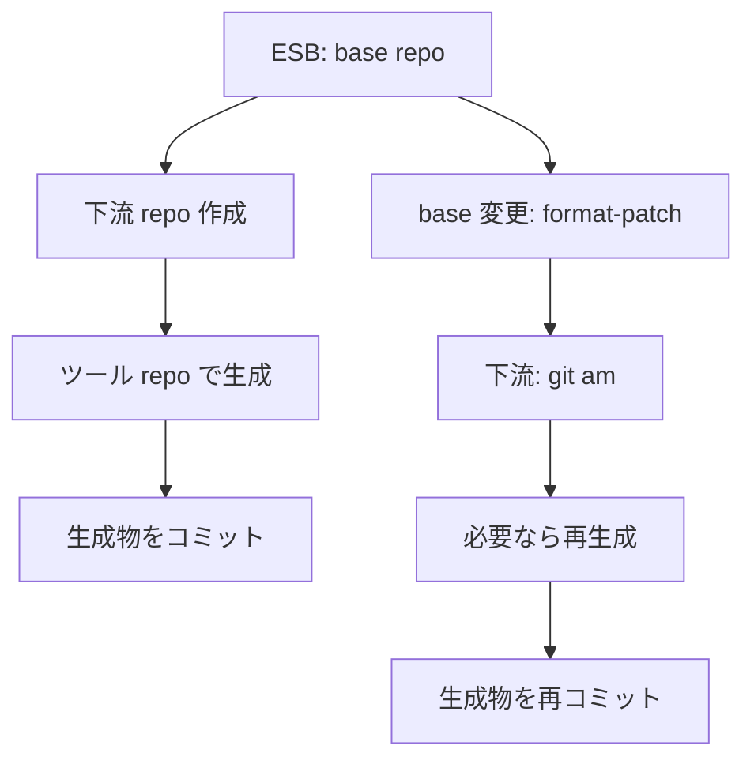
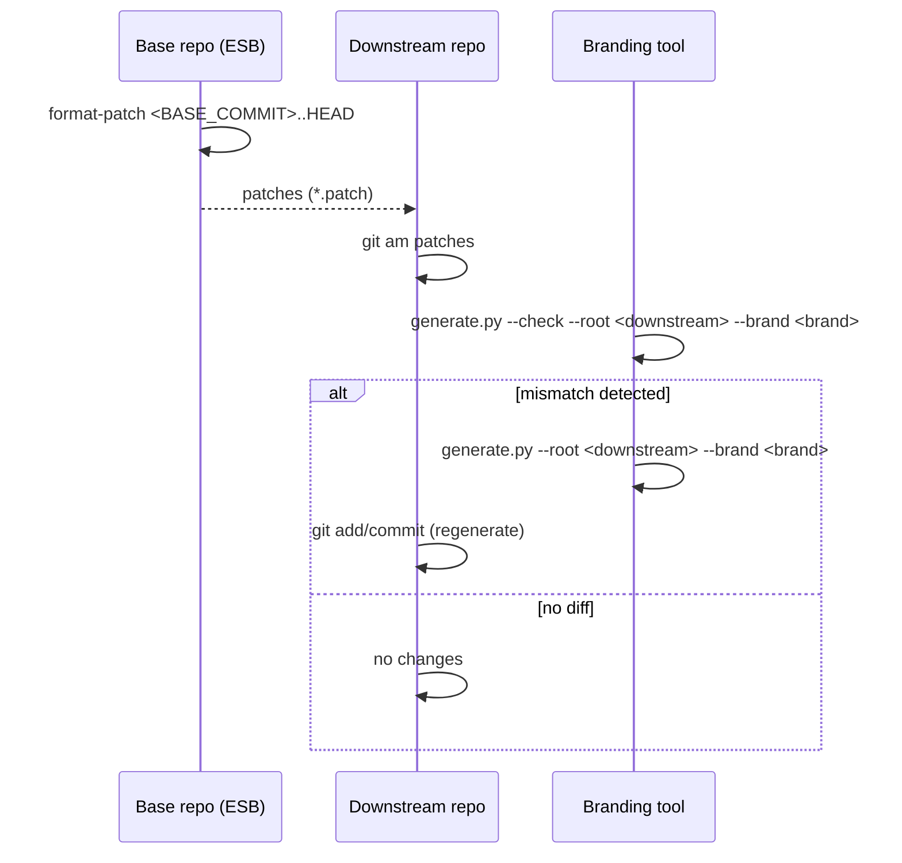

<!--
Where: docs/branding-flow.md
What: Branding generation + downstream update flow for ESB.
Why: Keep the tooling workflow and templates in a single source of truth.
-->
# ブランディング運用フロー（ESB + 下流）

## 目的と原則
- ESB 本体は常に `brand: esb` を維持する（下流固有情報は含めない）。
- ブランド変更は下流でのみ行う。
- 生成物のみコミットし、`.branding.env` は追跡しない。
- テンプレートと生成ツールは `esb-branding-tool` に集約する。

## 前提
- `uv` が使えること。
- 本ツール repo を利用できること。
- ESB が private の場合は clone できる認証情報（SSH もしくは Token）があること。

## フロー全体（概要）


## ツール repo のバージョン固定
再現性を担保するため、ツール repo はタグ/コミットで固定する。
```bash
git clone https://github.com/poruru-code/esb-branding-tool /tmp/esb-branding-tool
cd /tmp/esb-branding-tool
git checkout <tool-tag-or-commit>
```
ESB のスナップショットは `branding.lock` を参照する。
- `source.esb_commit`: 対象の ESB コミット
- `tool.commit`: 対応するツールコミット
- 下流の生成では `tool.commit` に合わせて `git checkout` する

## BASE_COMMIT の決め方
`BASE_COMMIT` は「下流が最後に取り込んだ ESB コミット/タグ」を指す。
- 例: 直近で取り込んだ ESB の commit SHA / tag
- 下流 repo 側で記録しておく（例: メモ用ファイルやタグなど）
生成時は `.esb-info` を使用する。
```bash
ESB_BASE_COMMIT=<sha>
# または
ESB_BASE_TAG=<tag>
```

## コマンド早見
- 生成: `uv run python tools/branding/generate.py --root <target> --brand <name>`
- チェック: `uv run python tools/branding/generate.py --root <target> --check --brand <name>`
- ヘッダー省略: `--no-header` を追加

## ESB の整合チェック（ベース側）
```bash
git clone https://github.com/poruru-code/edge-serverless-box /tmp/esb-check
cd /tmp/esb-branding-tool
git -C /tmp/esb-check checkout <esb_commit_or_tag>
uv run python tools/branding/generate.py --root /tmp/esb-check --check --brand esb
```
ESB 側の生成物が最新であることを前提とする。テンプレート更新後はツール repo 側で `--check` を行う。

## 下流でブランド変更（初回）
```bash
git clone <base-repo-url> <downstream-repo>
git clone https://github.com/poruru-code/esb-branding-tool /tmp/esb-branding-tool

cd /tmp/esb-branding-tool
uv run python tools/branding/generate.py \
  --root <downstream-repo> \
  --brand acme \
  --esb-base <base-commit-or-tag>

cd <downstream-repo>
git status -sb
git add .
git commit -m "Branding: acme"
```

## ベース変更の取り込み（パッチ運用）
```bash
# base 側
git format-patch <BASE_COMMIT>..HEAD -o /tmp/branding-patches

# downstream 側
git am /tmp/branding-patches/*.patch
```
`BASE_COMMIT` は「下流が最後に取り込んだ ESB コミット/タグ」を使用する。
取り込み後は下流 repo 側の記録も更新する。

パッチ適用後は必ず差分確認を行い、必要なら再生成して差分を固定する。
```bash
cd /tmp/esb-branding-tool
uv run python tools/branding/generate.py --root <downstream-repo> --check --brand <downstream_brand>
uv run python tools/branding/generate.py \
  --root <downstream-repo> \
  --brand <downstream_brand> \
  --esb-base <new-base-commit-or-tag>
cd <downstream-repo>
git add .
git commit -m "Branding: regenerate for upstream changes"
```

### パッチ適用時のシーケンス


## 生成時の副作用
- `config/branding.yaml` が指定ブランドで更新される。
- `.branding.env` が生成される（追跡しない）。

## ヘッダーの共通ルール
| ファイル形式 | コメント形式 | 内容（例） |
|---------------|--------------|------------|
| シェル/YAML/TOML/Go/Python | `#`（または Go の `//`） | `Where`, `What`, `Why`, `Source` を記載 |
| JSON（CNI など） | `_comment` フィールド | `"Auto-generated by branding generator. Do not edit directly. Source: ..."` |

テンプレートは `tools/branding/templates/` に配置し、生成後のファイルも同じ形式になるようにする。

## CNI 設定
- `services/agent/config/cni` には `10-<slug>.conflist` を 1 つだけ残す。
- ブランド変更時は旧ファイルを削除し、新しい `<slug>` のみ残す。

## ステージングキャッシュ
- ステージングはリポジトリ外に置く（`XDG_CACHE_HOME/<slug>/staging` を優先）。
- `ESB_CONFIG_DIR` はステージング済み `config/` を指し、Docker BuildKit の追加コンテキストとして使う。
- 関数イメージには `com.<slug>.image_fingerprint` ラベルを付け、更新判定に使う。

## CA とビルドフロー
- 証明書生成は ESB / 下流 repo 側で `uv run python tools/cert-gen/generate.py` を実行する。
- `CAROOT` は `~/.<slug>/certs` を使う。
- Docker ビルドでは `ROOT_CA_FINGERPRINT` を渡し、再生成済みの compose / runtime ファイルを参照する。

## テスト/確認
- 生成後は `uv run e2e/run_tests.py --reset --profile e2e-containerd` などで E2E を再実行し、CA/CNI/CLI 名称の整合性を確認する。
- 事前に `--check` で差分を確認してから書き出す。
