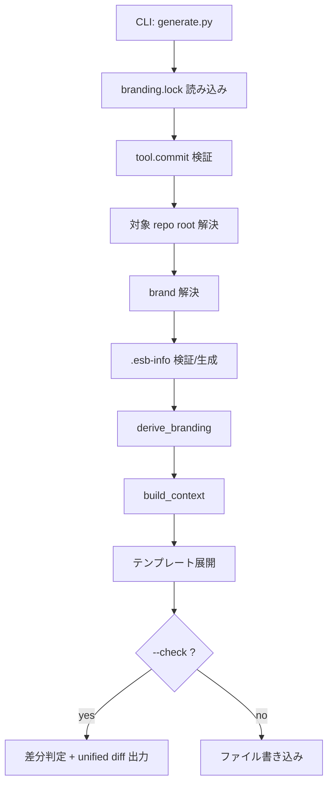
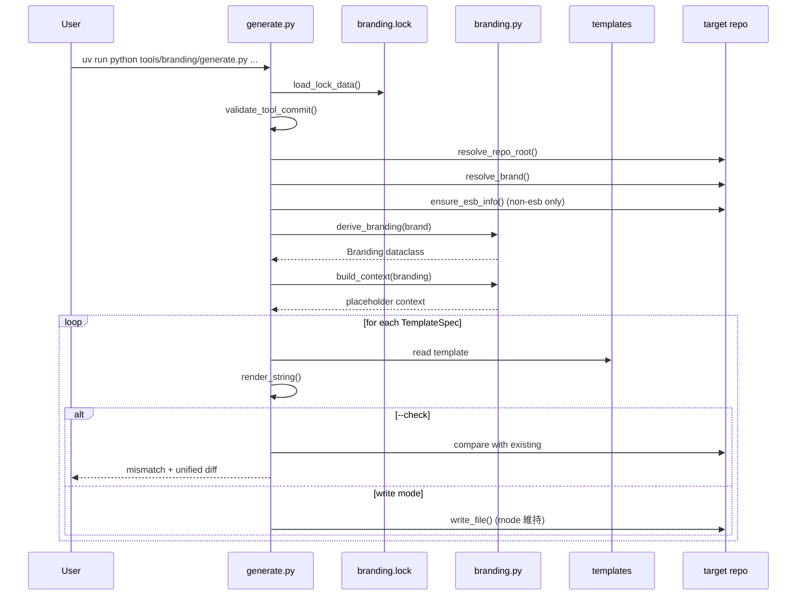
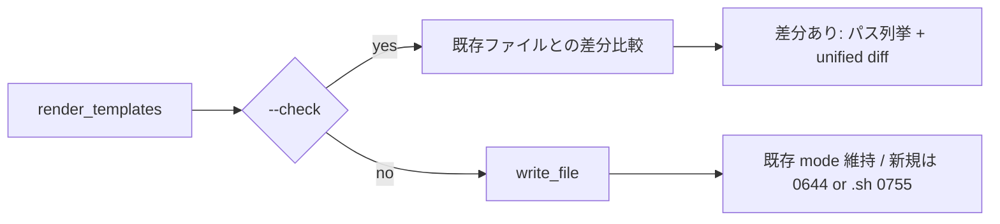

# ブランディング生成メカニズム

## 目的
このドキュメントは、`tools/branding/generate.py` がどの入力を使い、どの順序で検証・導出・書き込みを行うかを説明する。
運用手順は `docs/branding-flow.md`、本書は内部メカニズムに焦点を当てる。

## 全体像

## 実行シーケンス

## 入力と優先順位

### 1. ツール整合性 (`branding.lock`)
- `tool.commit` と現在のツール repo HEAD を比較する。
- 不一致時:
  - 既定: エラー終了
  - `--force`: 警告のみで継続

### 2. 対象リポジトリ (`--root`)
- `--root` 指定があればそれを利用。
- 未指定時は `cwd` から親を辿り、`docker-compose.yml` があるディレクトリを repo root とみなす。

### 3. ブランド名 (`--brand` / `config/branding.yaml`)
- 優先順位:
  1. `--brand <name>`
  2. `<root>/config/branding.yaml` の `brand:`
- `--check` かつ `--brand` と `branding.yaml` が不一致の場合はエラー。

### 4. 下流追跡情報 (`.esb-info`)
- `brand == "esb"`: スキップ。
- `brand != "esb"`:
  - `.esb-info` が無い場合、`--esb-base` 指定で生成。
  - `--check` 時に不足があればエラー。
  - `--esb-base` が SHA なら `ESB_BASE_COMMIT`、それ以外は `ESB_BASE_TAG` として書き込む。

## ブランド導出 (`tools/branding/branding.py`)

`derive_branding(brand)` は単一入力の `brand` から以下を導出する:
- `slug` (小文字/ハイフン)
- `env_prefix` (大文字/アンダースコア)
- `cli_name` (`slug` と同値)
- `label_prefix` (`com.<slug>`)
- `paths`, `root_ca`, `runtime` の派生値

`build_context()` はテンプレート置換用の `dict[str, str]` を構築する。
主要キー例:
- `SLUG`
- `CLI_NAME`
- `ENV_PREFIX`
- `HOME_DIR`
- `ROOT_CA_MOUNT_ID`
- `RUNTIME_*`

## テンプレートレンダリング

`generate.py` が現在レンダリング対象とするファイルは固定リスト (`TEMPLATES`)。

| Template | Output |
|---|---|
| `tools/branding/templates/docker-compose.docker.yml.tmpl` | `docker-compose.docker.yml` |
| `tools/branding/templates/docker-compose.containerd.yml.tmpl` | `docker-compose.containerd.yml` |
| `tools/branding/templates/docker-compose.infra.yml.tmpl` | `docker-compose.infra.yml` |
| `tools/branding/templates/docker-bake.hcl.tmpl` | `docker-bake.hcl` |
| `tools/branding/templates/.mise.toml.tmpl` | `.mise.toml` |
| `tools/branding/templates/e2e/runner/branding_constants_gen.py.tmpl` | `e2e/runner/branding_constants_gen.py` |
| `tools/branding/templates/pkg/deployops/branding_constants_gen.go.tmpl` | `pkg/deployops/branding_constants_gen.go` |

置換ルール:
- プレースホルダ形式: `{{ KEY }}`
- 未知キー: エラー
- 展開後に未解決プレースホルダが残る: エラー

## モード差分

- `--check`:
  - ファイル未存在/差分ありを mismatch として収集。
  - 差分内容は unified diff を標準出力に表示。
  - mismatch が1つでもあれば exit code 1。
- 通常実行:
  - レンダリング結果を対象ファイルに書き込み。
  - 既存ファイルの権限 mode は維持。

## 失敗時の観点
- `tool repo commit mismatch`: `branding.lock` の `tool.commit` と乖離。
- `brand mismatch for --check`: `--brand` と `config/branding.yaml` 不一致。
- `.esb-info missing`: 非 `esb` ブランドで下流追跡情報不足。
- `unknown template key`: テンプレートで未定義キーを参照。

## 変更時ガイド
- まず `tools/branding/branding.py` の導出値を更新する。
- 置換キー追加時は:
  1. `build_context()` にキー追加
  2. テンプレートで参照
  3. `--check` で差分確認
- 出力対象の追加は `generate.py` の `TEMPLATES` に明示的に追加する。
